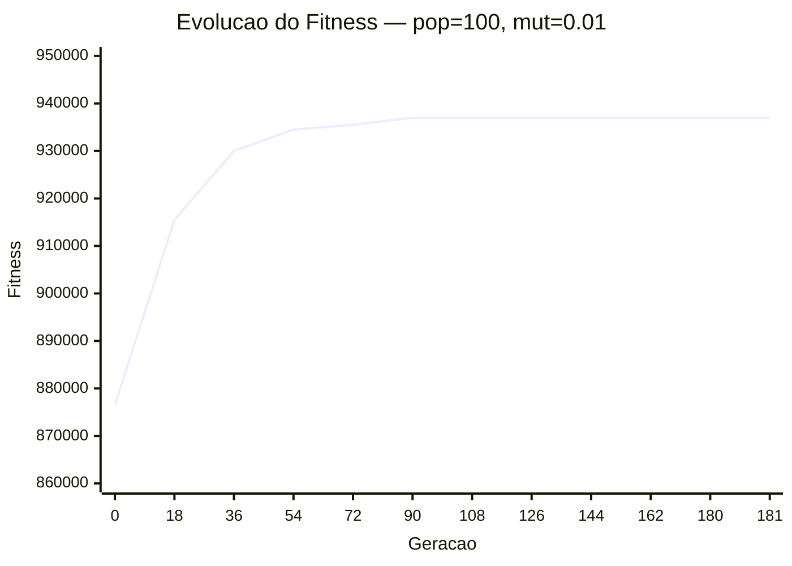
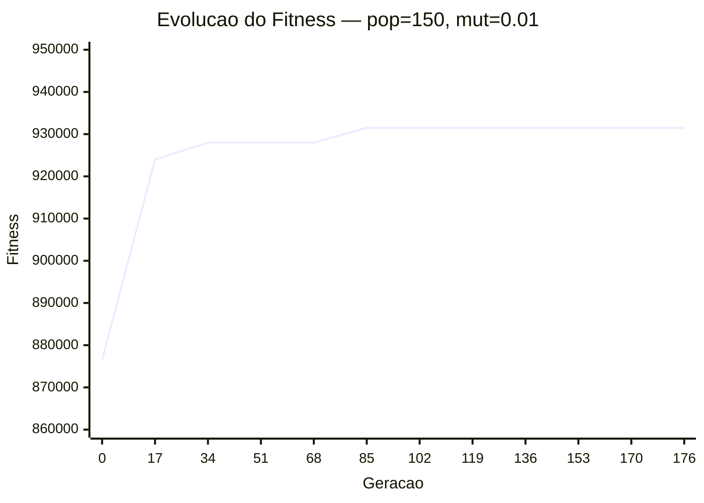

# Estudo de Hiperparâmetros

Experimento variando o **tamanho da população** e a **taxa de mutação**.
Número de gerações fixado em 300. Semente aleatória: 42.

## Tabela de Resultados

| Populacao | Mutacao | Melhor Fitness | Geracao de Convergencia | Violacoes | Tempo (s) |
|---|---|---|---|---|---|
| 50 | 0.01 | 933,000 | 224 | 5 | 6.3 |
| 50 | 0.03 | 940,500 | 139 | 3 | 4.6 |
| 100 | 0.01 | 937,000 | 81 | 3 | 4.7 |
| 100 | 0.03 | 934,500 | 69 | 2 | 6.3 |
| 150 | 0.01 | 931,500 | 76 | 4 | 8.2 |
| 150 | 0.03 | 937,500 | 226 | 3 | 17.2 |

## Análise

A melhor combinação encontrada foi **populacao=50, mutacao=0.03**, com fitness de **940,500** e 3 violacao(oes).

Populações maiores tendem a explorar melhor o espaço de busca, mas aumentam o custo computacional por geração. Taxas de mutação mais altas introduzem mais diversidade, o que ajuda a escapar de ótimos locais, porém pode desestabilizar indivíduos já bons se excessivamente alta.

## Gráficos de Convergência

### pop=50, mut=0.01

### pop=50, mut=0.03

### pop=100, mut=0.01

### pop=100, mut=0.03

### pop=150, mut=0.01

### pop=150, mut=0.03

