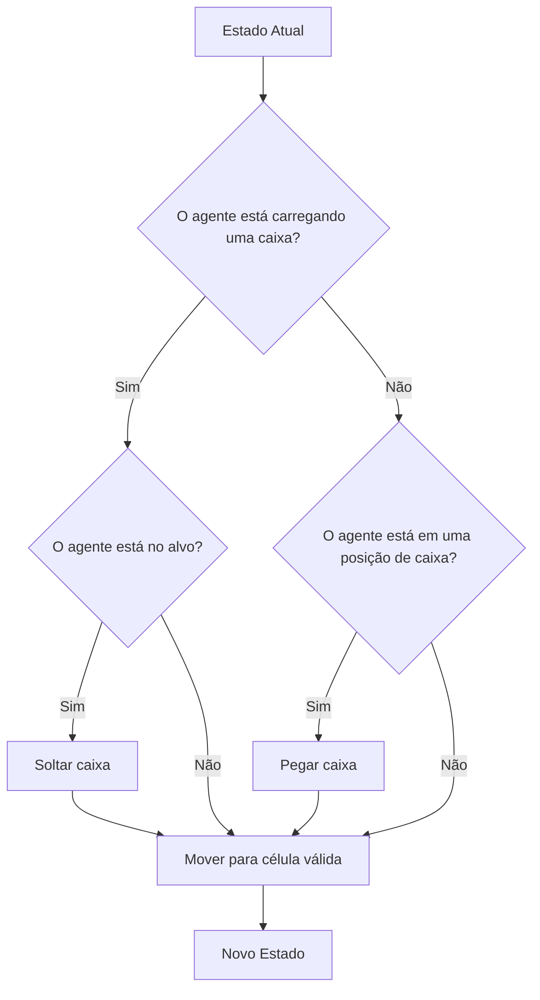

# Sokoban
## Execução do Projeto
Para executar o projeto localmente, siga os passos abaixo.

1. Clonar o repositório
```
git clone https://github.com/Pedro2000-ui/i.a.git
```

2. Acessar o diretório do projeto
```
cd eps/sokoban
```

3. Executar o programa
O programa recebe como parâmetro um arquivo de mapa.
```
python main.py maps/grid_escolhido.txt
```
Onde ```grid_escolhido.txt``` representa o mapa do Sokoban que será resolvido pelo algoritmo.

## Modelagem e Implementação do Problema
### Modelagem de Estados e Ações
O problema é modelado como um problema de busca em espaço de estados, no qual cada estado representa uma configuração válida do ambiente.

Um estado é representado pela seguinte estrutura:

$$estado = (agente, caixas, carregando)$$

onde:
- ```agente``` representa a posição do jogador no grid ```(x,y)```
- ```caixas``` representa o conjunto de caixas presentes no grid, cada uma descrita por ```(x,y,peso)```
- ```carregando``` indica se o ```agente``` está carregando uma ```caixa```
  
O ambiente é representado por um ```grid bidimensional```, composto por:
- paredes (```#```)
- espaços livres (```.```)
- posições alvo (```G```)
- caixas (```1 a 9```)
- posição do agente (```A```)

As ações posíveis do ```agente``` são:
- mover para cima (```C```)
- mover para baixo (```B```)
- mover para esquerda (```E```)
- mover para direita (```D```)
- pegar uma caixa (```P```)
- soltar uma caixa (```S```)
  
### Diagrama de Estados e Ações

## Funções
### Função Sucessora
A função sucessora recebe um estado e retorna todos os estados possíveis que podem ser alcançados através de uma única ação válida.

Formalmente:

$$Sucessor(estado) = {(novoEstado, movimento, custo)} $$

O processo de geração de sucessores funciona da seguinte forma:
1. O algoritmo verifica os quatros movimentos possíveis (```C```,```B```,```D```,```E```)
2. Caso a célula destino esteja livre (```.```), gera um novo estado com o agente (```A```) na nova posição, guardando qual movimento foi feito, atualizando o custo.
3. Caso exista uma caixa na posição do agente (```A```) e ele não esteja carregando nenhuma, pode executar a ação de pegar (```P```).
4. Caso o agente (```A```) esteja carregando uma caixa, e a célula estiver livre (```.```), pode executar a ação soltar caixa (```S```)

### Restrições
Durante a geração dos sucessores, o algoritmo verifica algumas condições para garantir que o movimento seja válido.

#### Verificação de limites do mapa
```python 
if nx < 0 or ny < 0 or nx >= len(grid) or ny >= len(grid[0]):
    continue
```

Nessa verificação:
- ```nx``` representa a nova linha
- ```ny``` representa a nova coluna
- ```grid``` representa o mapa do jogo

As condições verificam se a nova posição está ```fora dos limites do grid```. Caso isso aconteça, o movimento é ignorado e o algoritmo continua avaliando outras direções.

#### Verificação de paredes
```python
if grid[nx][ny] == "#":
    continue
```

Se a célula de destino for uma parede (```#```), o movimento não é permitido. Portanto, o algoritmo ignora essa direção.

Essas verificações garantem quem:
- O agente (```A```) não saia do mapa (```grid```)
- O agente (```A```) não atravesse paredes (```#```)
- apenas movimentos válidos sejam considerados na busca

### Função Objetivo
O objetivo do problema é posicionar ```todas as caixas nas posições alvo```

Sejam:
- $C$ o conjunto de posições das caixas
- $A$ o conjunto de posições alvo

O estado é considerado objetivo quando:

$$C ⊆ A$$

Ou seja, todas as caixas estão localizadas em posições correspondentes aos alvos. Porém, o agente (```A```) não pode terminar o algoritmo em uma posição de alvo.

O algoritmo de verificação consiste em:
1. Percorrer todas as caixas (```1 a 9```).
2. Verificar as restrições.
3. Caso satisfaça todas as restrições, o estado é considerado objetivo.

### Restrições
Algumas restrições são impostas, para que o objetivo do jogo será considerado concluído.
#### Verificação carregando caixa
```python
if carregando is not None:
    return False
```
O agente (```A```) não pode estar em posse de nenhuma caixa (```1 a 9```) ao término do algoritmo.

#### Verificação das caixas
```python
for x,y,p in caixas:
    if (x,y) not in alvos:
        return False
```
Todas as caixas (```1 a 9```) devem estar em algum alvo (```G```), após o término do algoritmo.

#### Verificação do agente
```python
if agente in alvos:
    return False
```
O agente (```A```) não pode estar em uma posição de alvo (```G```), após o término do algoritmo.

### Função Heurística
#### Distância Manhattan
A distância Manhattan mede a distância entre dois pontos em um grid considerando apenas movimentos horizontais e verticais.

Matematicamente:
```
d = ∣x1​ − x2​∣ + ∣y1 ​− y2​∣
```

Exemplo:
- caixa (```1 a 9```) em (```2,3```)
- alvo (```G```) em (```5,7```)
  
Distância:
``` 
|2 - 5| + |3 - 7| = 3 + 4 = 7
```

Ou seja, no mínimo 7 movimentos seriam necessários para alinhar esses pontos em um grid sem obstáculos.

O Sokoban acontece em um ```grid ortogonal```:
- o agente (```A```) anda cima (```C```), baixo (```B```), esquerda (```E```), direita (```D```).
- caixas (```1 a 9```) também se movem nas mesmas direções.
Ou seja, ```não existem movimentos diagonais```

Por isso, a distância Manhattan é uma boa heurística para esse problema.

#### Algoritmo
Para cada caixa (```1 a 9```):
1. Calcula-se a distância Manhattan até todos os alvos (```G```).
```python
for ax,ay in alvos:
    dist = abs(x-ax) + abs(y-ay)
```

2. Seleciona o alvo (```G```) mais próximo.
```python
menor = min(menor, dist)
```

3. Multiplica essa distância pelo peso da caixa (```1 a 9```).
```python
menor * p
```

4. Soma o valor para todas as caixas.
```python
heuristica += menor * p
```

Sendo cada caixa ```i``` e ```pi``` o peso da caixa, a heurística total é definida como:

$$ h(n) = \sum_{i=1}^{k} p_i \cdot \min_{j} \left(|x_i - a_j| + |y_i - b_j|\right) $$

- ```k``` = número de caixas
- (```xi,yi```) = posição da caixa ```i```
- (```aj,bj```) = posição do alvo ```j```
- ```pi``` = peso da caixa ```i```

### Função Custo
A função custo representa o esforço necessário para executar as ações do agente (```A```).

O custo depende do tipo de ação realizada.

Sejam:
- ```p``` o peso da caixa
- ```c(a)``` o custo da ação ```a```

#### Movimento sem carregar caixa
Quando o agente (```A```) move-se para uma célula livre (```.```) sem carregar uma caixa (```1 a 9```):

$$ c(a) = 1 $$

#### Movimento carregando uma caixa
Quando o agente (```A```) está carregando uma caixa (```1 a 9```) de peso ```p```

$$ c(a) = 1 + p $$

Isso representa o esforço adicional necessário para transportar a caixa.

#### Ação de pegar ou soltar caixa
As ações de manipulação da caixa (```1 a 9```) também possuem custo.

$$ c(a) = 1 $$

#### Custo total de um caminho
O custo acumulado até um estado ```n``` é:

$$ g(n) = \sum_{t=1}^{T} c(a_t) $$


onde:
- $T$ é o número de ações executadas.
- $c(a_t)$ é o custo da ```ação``` no passo $t$

## Algoritmos de Busca
O projeto utiliza uma única função de busca baseada em fila de prioridade (```heapq```).
A cada iteração, o estado com menor prioridade é removido da fila e expandido, gerando novos estados a partir da função ```sucessores```.

Cada estado da fila contém:
- ```prioridade```: valor usado para decidir qual estado será expandido primeiro.
- ```state:``` configuração atual do Sokoban.
- ```path:``` sequência de movimentos realizados e custos por movimento até aquele estado.
- ```custo:``` custo acumulado do caminho até o estado

Durante a execução, o algoritmo:
1. Insere o estado inicial na fila de prioridade.

- O algoritmo começa inserindo o estado inicial na fila com prioridade 0.

    ```python
    heapq.heappush(fila, (0, start, [], 0))
    ```
Onde:
- ```0``` → prioridade inicial
- ```start``` → estado inicial
- ```[]``` → caminho ainda vazio
- ```0``` → custo acumulado inicial

2. Remove o estado de menor prioridade.

- Em cada iteração do laço principal, o estado com menor prioridade é removido da fila.

    ```python
    prioridade, state, path, custo = heapq.heappop(fila)
    ```
Como a fila é uma min-heap, o estado removido sempre será aquele com menor valor de prioridade.

3. Verifica se ele é um estado objetivo.

- Depois de remover o estado da fila, o algoritmo verifica se ele representa uma solução do problema.
    ```python
    if objetivo(state, alvos):
        return state, path, custo, visit
    ```


4. Caso não seja, gera seus sucessores.

- Se o estado atual não for o objetivo, o algoritmo gera todos os possíveis estados seguintes.

    ```python
    for novo, mov, c in sucessores(grid, state):
    ```

5. Cada sucessor é inserido novamente na fila com uma prioridade calculada de acordo com o modo escolhido.

- Primeiro o custo acumulado é atualizado:
    ```python
    novo_custo = custo + c
    ```

- Depois, a prioridade do estado é calculada dependendo do algoritmo escolhido.
    ```python
    if modo == "dijkstra":
        prioridade = novo_custo

    elif modo == "ganancioso":
        prioridade = heuristica(novo, alvos)

    else:
        prioridade = novo_custo + heuristica(novo, alvos)
    ```

- Por fim, o novo estado é inserido novamente na fila:
  ```python
  heapq.heappush(
    fila,
    (prioridade, novo, path + [(mov, c)], novo_custo)
    )
  ```

Isso garante que o estado será explorado futuramente, respeitando a ordem definida pela prioridade.

Para evitar expandir estados repetidos, é mantido um conjunto ```visit``` contendo os estados já explorados.

A principal diferença entre os algoritmos utilizados (```Dijkstra```, ```Ganancioso``` e ```A*``` ) está na forma como a prioridade de cada estado é calculada.

### Dijkstra
Quando o algoritmo está no modo ```Dijkstra```, a prioridade de cada estado é definida apenas pelo custo acumulado do caminho:

```python
prioridade = novo_custo
```
Isso faz com que o algoritmo sempre expanda primeiro os estados com menor custo total desde o início.

Como consequência:
- O algoritmo garante encontrar o caminho de menor custo.
- Porém, ele não utiliza nenhuma informação sobre a distância até o objetivo e isso faz com que muitos estados sejam explorados antes de encontrar a solução.

Em grids maiores do Sokoban, esse comportamento faz com que o algoritmo expanda um número muito maior de estados, tornando a busca mais lenta.


### Ganancioso
No modo ```Ganancioso```, a prioridade considera apenas a heurística:

```python
prioridade = heuristica(novo_estado)
```

A heurística estima o quão próximo o estado está do objetivo.

Dessa forma, o algoritmo sempre tenta expandir primeiro os estados que parecem mais próximos da solução.

Como consequência:
- O algoritmo costuma expandir menos estados.
- A busca tende a ser mais rápida.
- Porém, como ele ignora o custo acumulado do caminho, pode escolher caminhos que parecem bons inicialmente, mas acabam sendo mais caros.

Por isso, o método ganancioso não garante encontrar o caminho de menor custo.

### A*
No modo ```A*```, a prioridade combina o custo do caminho já percorrido com a estimativa de distância até o objetivo:

```python
prioridade = novo_custo + heuristica(novo_estado)
```

Esse equilíbrio faz com que o algoritmo considere:
- o custo real já percorrido.
- uma estimativa do custo restante até o objetivo.

Na prática, isso faz com que o algoritmo:
- explore menos estados do que o ```Dijkstra```, especialmente em grids maiores.
- mantenha a capacidade de encontrar o caminho de menor custo.

Por utilizar tanto o custo acumulado quanto a heurística, o ```A*``` costuma apresentar o melhor desempenho ```geral``` entre os três métodos.

## Testes
### Análises

## Conclusão
