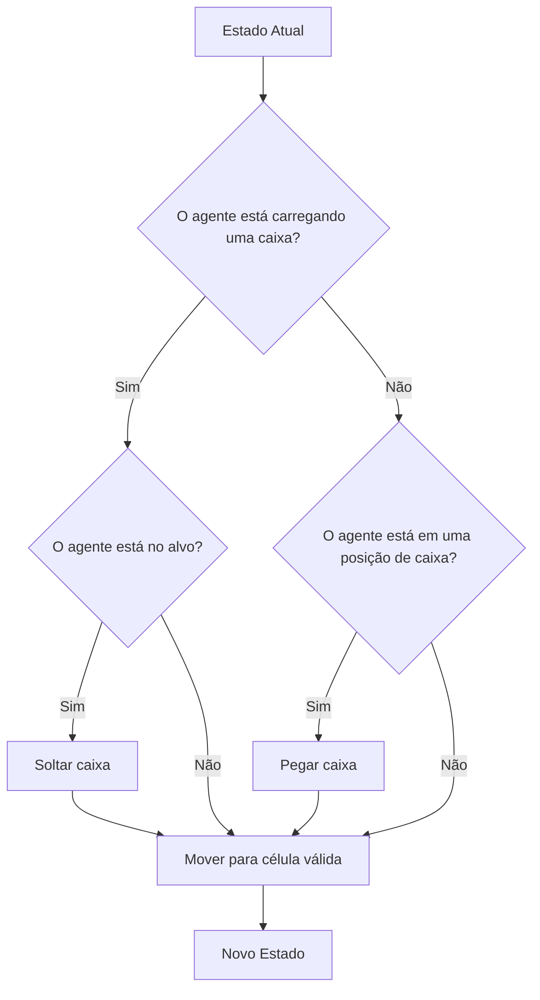

```mermaid
flowchart TD

EstadoAtual[Estado Atual]

Mover[Mover para célula válida]
Pegar[Pegar caixa]
Soltar[Soltar caixa]

Carregando{O agente está carregando uma caixa?}
Alvo{O agente está no alvo?}
Caixa{O agente está em uma posição de caixa?}

NovoEstado[Novo Estado]

EstadoAtual --> Carregando

Mover --> NovoEstado

Pegar --> Mover

Carregando -->|Sim| Alvo
Carregando -->|Não| Caixa

Alvo -->|Sim| Soltar
Alvo -->|Não| Mover

Caixa -->|Sim| Pegar
Caixa -->|Não| Mover

Soltar --> Mover
```